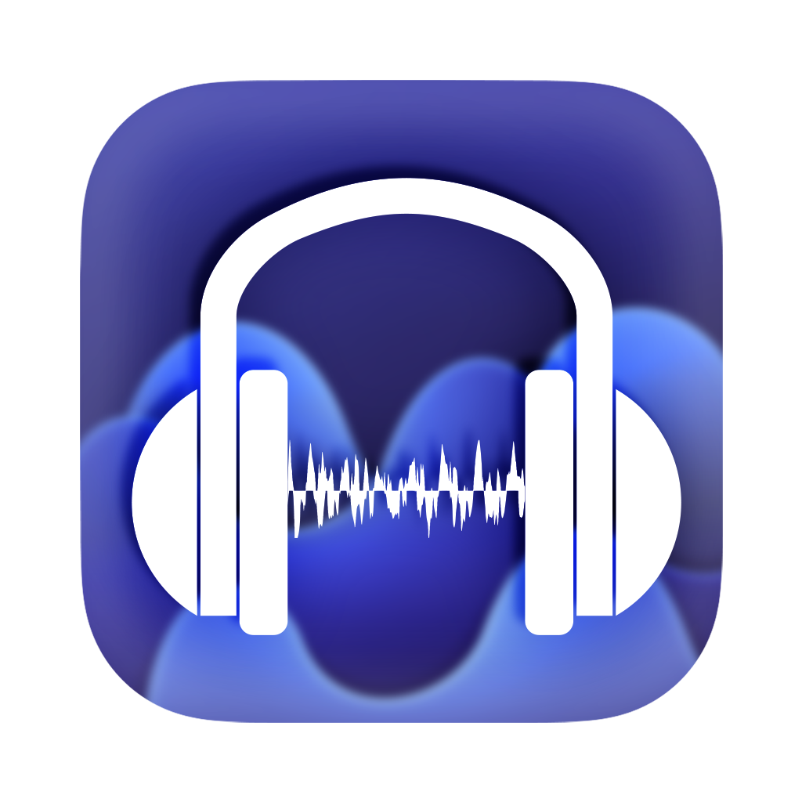

# Dacx: Cross-Platform Music and Video Player

Fast, lightweight, open source desktop media player for Windows, macOS, and Linux.

Built with Flutter + [media_kit](https://github.com/media-kit/media-kit) (libmpv). **Website:** [rosie.run/dacx](https://rosie.run/dacx)

[](https://github.com/BurntToasters/Dacx/releases/latest)
[](https://github.com/BurntToasters/Dacx/releases)
[](https://github.com/BurntToasters/Dacx/actions/workflows/test.yml)
[](LICENSE)

Dacx is a lightweight desktop music and video player focused on speed and low overhead — a modern libmpv-based alternative for local playback on Windows, macOS, and Linux, with playlists, a 10-band equalizer, media-session controls, and broad format support.

<div align="center">
  <table>
    <tr>
      <td valign="middle" align="center" width="220">
        
      </td>
      <td valign="middle" align="center">
        <p align="center">
  
&nbsp;
</p>
      </td>
    </tr>
  </table>
</div>

<h1 align="center">⬇️ Download Dacx</h1>
<p align="center">Need assistance? Check out the <b><u><a href="./docs/INSTALL.md">Installation Documentation</a></u></b>!</p>
<div align="center">
  
|  Windows |  MacOS |  Linux |
| :--- | :--- | :--- |
| **MSI:** [x64](https://github.com/BurntToasters/Dacx/releases/latest/download/Dacx-Windows-x64.msi) | **DMG:** [Universal](https://github.com/BurntToasters/Dacx/releases/latest/download/Dacx-macOS.dmg) | **AppImage:** [x64](https://github.com/BurntToasters/Dacx/releases/latest/download/Dacx-Linux-x86_64.AppImage) |
| | **ZIP:** [Universal](https://github.com/BurntToasters/Dacx/releases/latest/download/Dacx-macOS.zip) | **DEB:** [x64](https://github.com/BurntToasters/Dacx/releases/latest/download/Dacx-Linux-amd64.deb) |
| | | **RPM:** [x64](https://github.com/BurntToasters/Dacx/releases/latest/download/Dacx-Linux-x86_64.rpm) |
| | | **Flatpak:** [x64](https://github.com/BurntToasters/Dacx/releases/latest/download/Dacx-Linux-x86_64.flatpak) |
| | | **TAR.GZ:** [x64](https://github.com/BurntToasters/Dacx/releases/latest/download/Dacx-Linux-x86_64.tar.gz) |

</div>

## Platforms

- Windows
- macOS
- Linux

## Features

- Audio + video playback for MP3, FLAC, WAV, OGG, AAC, Opus, MP4, MKV, AVI, WebM, and more (anything libmpv handles).
- Playlist files (`.m3u` / `.pls` import + save queue as `.m3u`); HLS `.m3u8` streams via mpv.
- Playback speed control (transport chip + `[` / `]` / `\` shortcuts).
- External audio / subtitle track load from the more menu.
- 10-band equalizer with presets.
- Experimental Features (off by default): unfinished ideas such as Linux compositor blur. Multi-audio mix is implemented but withdrawn from the UI until linked libmpv has `amix`/`aformat` on every platform (`docs/ideas/multi-audio-mix.md`).
- Optional seek thumbnails (Playback settings; uses extra memory).
- Window transparency / background blur on Windows and macOS (Appearance settings). Linux compositor blur remains experimental.
- Resume a file from its previous position when you reopen it; relaunch starts at the empty home screen.
- Compact mode and always-on-top window.
- System media-session integration: lock-screen / Now Playing / SMTC / MPRIS controls, artwork, rate, and scrubbing.
- File associations + custom document icon on Windows, macOS, and Linux.
- Built-in update checker: in-app self-update on **Windows (MSI)** and **macOS** (`/Applications`). On **Linux**, prefer the **AppImage** managed with [AppManager](https://github.com/kem-a/AppManager) for install + updates (no in-app Linux installer).
- Notarized & signed DMG/ZIP for macOS. Official Windows MSIs are Authenticode-signed with Azure Artifact Signing (SmartScreen still may warn on first run). Linux packages carry **GPG** detached signatures. See `SECURITY.md`.

## Support contract (v1 readiness)

- **UI language:** English only (`lib/l10n`).
- **macOS:** 15 (Sequoia) or newer.
- **CPU arch:** Windows/Linux ship **x64** only (arm64 not a priority).
- **Linux (recommended):** [AppImage](https://github.com/BurntToasters/Dacx/releases/latest/download/Dacx-Linux-x86_64.AppImage) + [AppManager](https://github.com/kem-a/AppManager) for desktop install and updates. **AppImage / tar / Flatpak bundle libmpv.** deb/rpm declare a distro `libmpv` dependency instead. **Flatpak** is GitHub-sideload only (not Flathub).
- **Experimental Features:** Long-lived opt-in lane (off by default) for unfinished / in-progress ideas (Linux compositor blur, …). Multi-audio mix stays in code but is not user-facing. Features may graduate to stable settings (like Win/mac blur) or stay experimental indefinitely; not a blocker for `1.0`.
- **Windows portable ZIP:** No longer shipped; use the MSI.

## Development

> [!NOTE]
> This project uses Flutter/Dart but also NodeJS. Its a little bit messy and not the best of practices I know, im just the most familiar and confident with js scripting and node so thats how the project is controlled. Sorry :P

```bash
# Install Node.js dependencies (build scripts)
npm install

# Install / repair FVM and Flutter (.fvmrc), then fetch packages and l10n
npm run setup:flutter

# Run in development mode
npm run dev

# Run tests
npm run test:all

# Build for current platform
npm run build:win   # Windows
npm run build:mac   # macOS
npm run build:linux # Linux
```

### Signing model

macOS releases are fully code-signed and notarized. Windows releases are fully code-signed using Azure Artifact Signing. Linux DEB/RPM/TAR.GZ artifacts are signed with a **GPG detached signature** (the project's release key). Ed25519 remains the primary self-update trust, and Authenticode signing provides OS-level trust verification (see `SECURITY.md`).

This means:

- `scripts/flutter-build-macos.js` requires `APPLE_TEAM_ID` in `.env`. Self-update pins against the team id. Set `DACX_BUILD_DEV_NO_TEAM_ID=1` to skip for local dev:
  ```bash
  DACX_BUILD_DEV_NO_TEAM_ID=1 npm run build:mac
  ```
- `scripts/flutter-build-windows.js` signs official MSIs with Azure Artifact Signing when `AZURE_CLIENT_ID`, `AZURE_TENANT_ID`, `AZURE_CLIENT_SECRET`, `AZURE_ARTIFACT_SIGNING_ENDPOINT`, `AZURE_ARTIFACT_SIGNING_ACCOUNT`, `AZURE_ARTIFACT_SIGNING_PROFILE`, and `AZURE_ARTIFACT_SIGNING_PUBLISHER` are set. The publisher string is baked in as `--dart-define=DACX_WINDOWS_SIGNER_PUBLISHER=...`. Set `SKIP_WIN_CODESIGN=1` for local unsigned builds. The Windows build also ships `dacx-update-helper.exe` next to `dacx.exe` for post-exit MSI install.
- `scripts/flutter-build-linux` is not affected by either.

### macOS support

The macOS build targets **macOS 15 (Sequoia) or newer**. Older macOS versions are not supported.

## License

[GPLv3](LICENSE)
